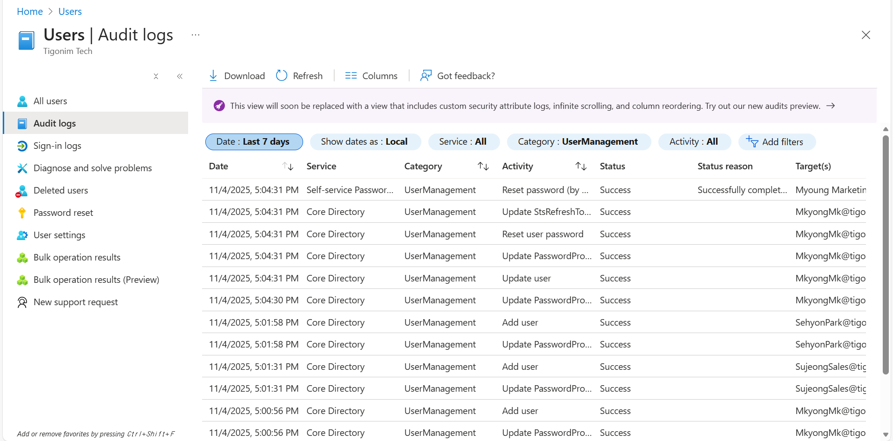

# User Management 
- This section describes about user management of Entra
- Before that, to create Entra(Azure AD) opening Azure is needed and I chose developer license(free) to use

- After logging in and choose license, it will open Azure Portal 

- Then clicking Entra ID will open management of Entra section but also admins can directly access Entra through webpage

## Add User to Entra

- To add user to Entra service, go to User on management section of Entra
- Name of whole domain will be Tigonim Tech since it's built by my account

- Click creating new user and if it's external account, it can be invited through here

- On this page, setting up basic account name can be applied so as baisc information
- Also, if needed, it can disable account even creating it, allow enable after user need access to account

- Job information and identity can be added if it's needed as policy or process

- After adding users, it can be checked through user list page 

- Clicking on User allows admin to check what information is added into this account

- Most commonly used task is resetting user's password and it can be done on that user's page

- On user setting section, there can be few rules added to here 
- Typically, security groups aren't allowed to users, only ones with the roles can 

- Also, on Audit logs, it helps admin to check what users have performed with this account
