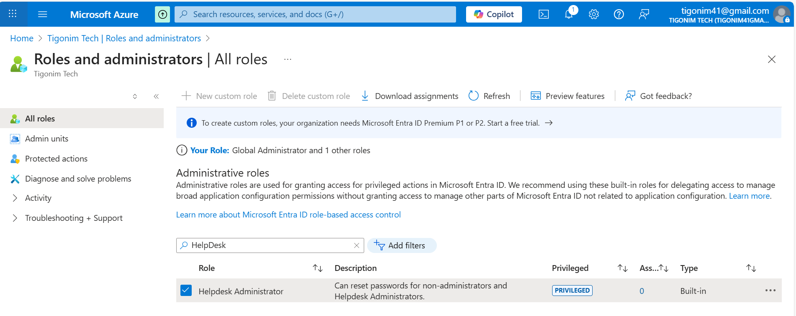
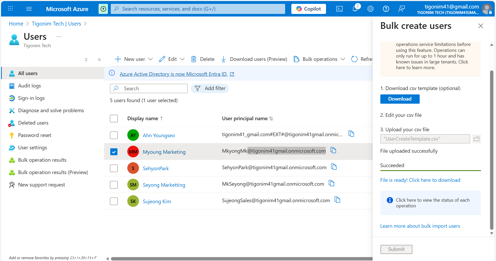
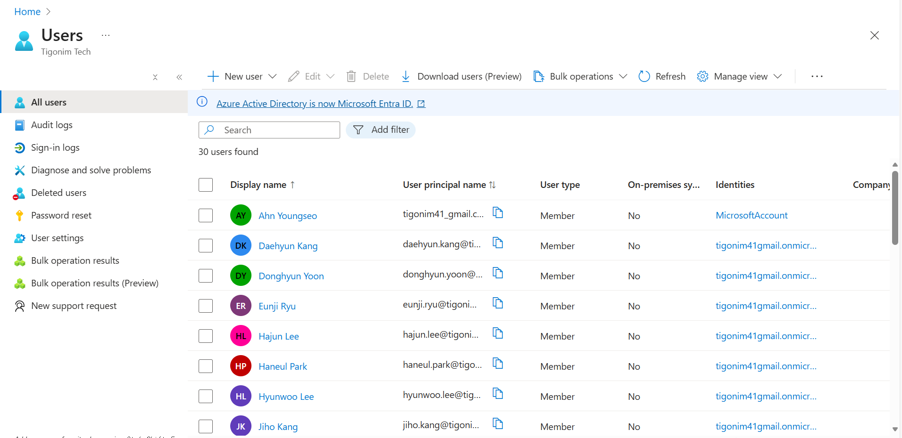

# Additional User Management
- After basic user management there can be extra management
- Such as bulk user add and giving the roles 

## Giving Roles to Users

- On Roles and administrators, there are list of roles built in Microsoft Entra
- There are a lot of them just choose and apply but it requires P1 or P2 license to create roles

- The highest role that can basically control everything is called Global Admin
- It needs to be limited only very little amount of users and it will be the practice sample

- After clcking global section it will be visible who is in and it's me who created Entra
- Clicking add assignment allows to add different user to this role

- This displays list of users to click and give the role, but always need to be careful with adding
- Especially with global admin, it can affect anything on Entra

- This is helpdesk role that's most common to use for IT helpdesk and manager
- With this and if needed, considering user can be Level 2 for helpdesk, apply different roles together

- For example, helpdesk shouldn't be applying any policy changes to security 
- However, sometimes to trouble shoot, some of the applications might not perform due to security
- To check, security reader role allows user to view security policies but not change

## Bulk Add user List

- If it's more than 5 users, sometimes it needs to add hundreds of users at once
- It's not efficient to add them one by one and that's why bulk add exist
- After downloading form on the right, add user info that's needed for creating user

- Add user information within and save the file

- Upload it on Bulk Add which allows to actually load information to Entra users
- Make sure to download on Click Here to Download because that's where first login password is in
- If it's missed, then there are no way to find first login password, needs reset 

- Then as a result, list of users will be added