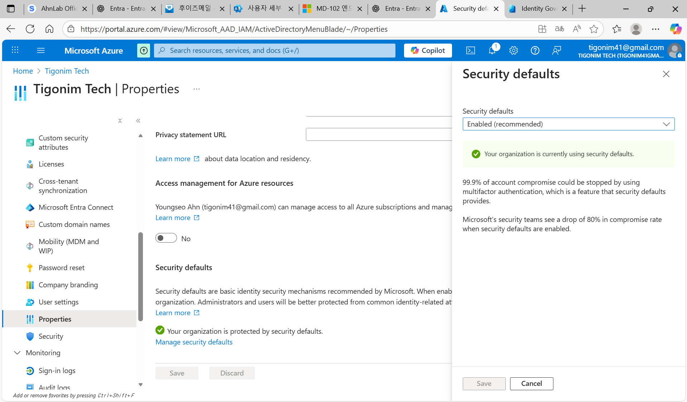

# Device Management and Security
- This section will demonstrate some of options to set up security and managing device 

## Device Management 

- On this section there are setting management when joining Entra
- Allowed users to join devices to Entra so it can manage devices
- Require MFA when user accessing device login which will prevent others to access device

- Local Administrator setting can manage device's local admin account
- Allowed when user joins Entra, it automatically adds global admin as local admin
- It gives access in case user does not have internet access, it still allows run programs as admin with Global admin account
- Did not add user as local admin, which gives more control that user cannot download everything
- Also set bitlocker key restriction to the user for recovery so it can be managed by admins

## Security Default

- This is one of the easiest level of security if there isn't conditional access settled
- It run basic restriction like defending against fishing, MFA enforcement, firewalling, and others 
- But if Tenant is using conditional access, it might conflict to each other 

## Monitoring 

- This is where admin can view specific sign in events only, if it fails it still displays too
