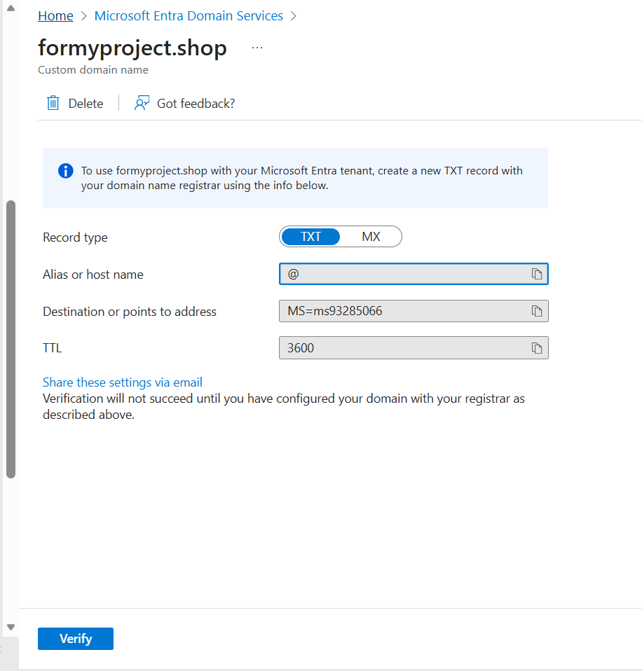
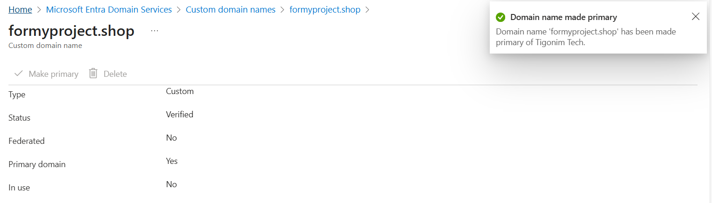

# Connecting Custom Domain 
- This is section that progress of adding custom domain to Tenant 

## Add Custom Domain

- This is the page for adding the custom domain and there is already a domain under my account
- On here, click add custom domain then it will ask which domain name
- For this, I bought cheap domain to process with this 

- On this, there are TXT DNS information to enter on website that's providing the domain

- This is the Domain website to enter information 
- First section is Type, which is TXT
- Second section is @ as MS displayed
- Set location same as it's displayed so as TTL number

- Click Verify then it will confirm that it's verified which is added to Entra

- Then I set it as Priamry domain which will affect account creation that they will use this domain as default

- Then when I create user, option of using new domain is allowed and also it's the default of using this domain